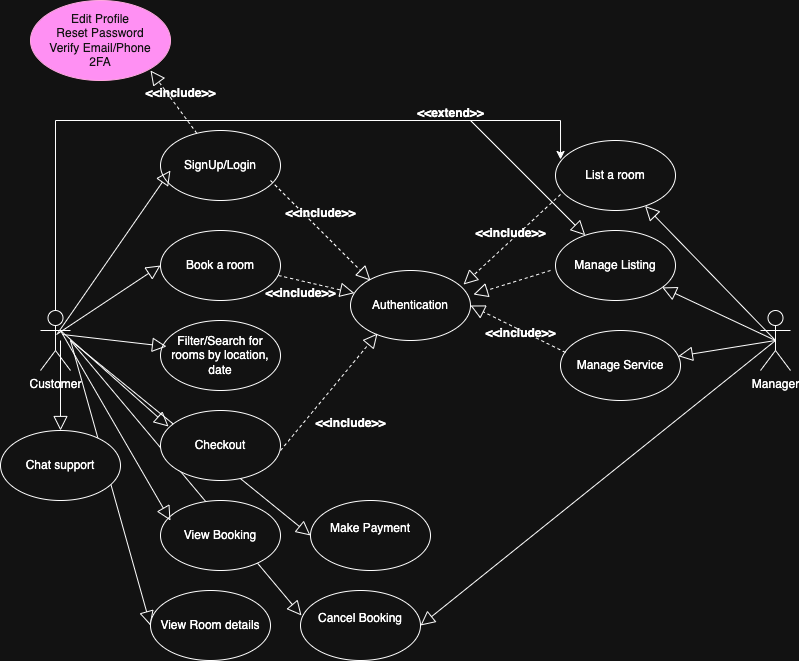

# Requirement Analysis in Software Development.

This project focuses on Crafting Blueprint of a hotel booking management application.

## 📌 What is Requirement Analysis?

Requirement Analysis is the process of identifying, understanding, and documenting the needs and expectations of stakeholders for a software system.
It serves as the foundation and blueprint of the entire project. Hence, it helps bridge the gap between what users want and what developers build.

## ❓ Why is Requirement Analysis Important?

### 🎯 Clarity & Alignment

- ✅ Ensures everyone understands the same goals (clients, users, devs, designers).
- 🚫 Prevents miscommunication and scope creep.

### ⏱️ Cost & Time Efficiency

- 💡 Fixing a mistake in the requirements phase is cheaper than fixing it after development.
- 🛠️ Helps avoid rework by defining things right from the start.

### 🧪 Improved Quality

- 🎯 Leads to building the right product with the right features.
- 🐞 Reduces bugs and boosts user satisfaction.

## 🧩 Key Activities in Requirement Analysis.

### 1️⃣ Requirement Gathering

This is the first activity that involves Collecting informations from clients, users, or business stakeholders.

- 🗣️ Interviews with users or managers
- 📋 Surveys or questionnaires
- 📁 Reviewing old systems
- 👀 Observations and workshops

### 2️⃣ Requirement Elicitation

This step involves going deeper to discover hidden needs, goals, or constraints.

- ❓ Ask why, not just what
- 🧠 Use scenarios, storyboards, or brainstorming
- 🔍 Discover pain points, edge cases

### 3️⃣ Requirement Documentation

This activity involves writing the requirements in a clear and organized way.

- 📝 Use User Stories, Software Requirements Specification (SRS), or Use Cases
- 🧾 Should be easy for both business and tech people to read

### 4️⃣ Requirement Analysis and Modeling

This step breaks down and visualize requirements.

- 🧮 Categorize into functional vs non-functional
- 🗂️ Create Use Case Diagrams, Data Flow Diagrams
- 📊 Prioritize and model the flow of the system

### 5️⃣ Requirement Validation

This stage confirms the requirements are correct and complete.

- ✅ Review with stakeholders
- 🧪 Use prototypes, mockups, or meetings
- ✔️ Validate each requirement is testable and clear

## ⚖️ Types of Requirements

### ✅ Functional Requirements

This requirement checks what the system should do. For instance:

- Users can book a room
- Users can filter by date
- Users can cancel a reservation
  \_ Users can signup and login an account

### ⚙️ Non-functional

This checks how the system performs or behaves. For instance:

- Booking must complete in <3 seconds
- site must be online 99.9% uptime

## 🧩 Use Case Diagrams

This involves the actions actors can perform to interact with the system.
This is beneficial because:

- Helps visualize what the system should do
- Easy to explain to non-technical users
- Useful during requirement reviews

## 🎯 Acceptance Criteria

### Importance of Acceptance Criteria

- Helps devs and testers know what to build/test
- Ensures client expectations are met
- Makes requirements clear, testable, and verifiable

#### 💡 Example: Acceptance Criteria for "Checkout" Feature in Booking System

**Feature:** Guest can complete a booking checkout

**Acceptance Criteria:**

- Customer must be logged in
- Customer must select a valid booking date range
- Customer must enter payment info
- Payment must be processed successfully
- Confirmation email must be sent after successful booking
  ✅ If all these conditions are met, the feature is considered complete and accepted.
